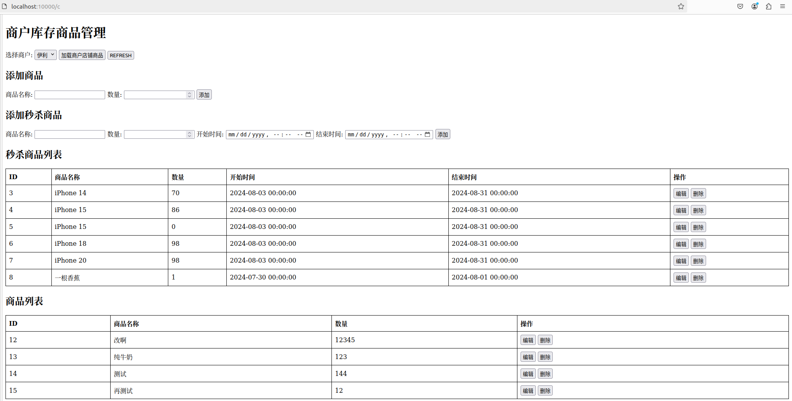
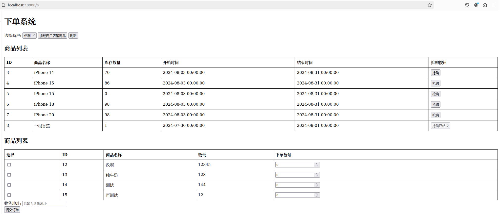
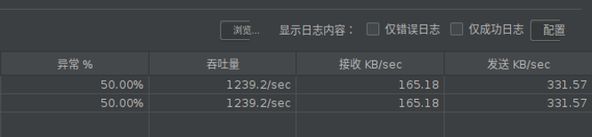

# webserver
---
参考[qinguoyi/TinyWebServer](https://github.com/qinguoyi/TinyWebServer) 与 Linux高性能服务器编程，游双著.搭建了Linux下C++轻量级Web服务器。实现了商品库存管理及下单功能，应用Redis实现秒杀场景高并发。
# 编译
---
基于CMake编译，生成的可执行文件在./bin目录下。

```sh
cmake .
make
```
# 运行
```sh
cd bin
./main $port
```
## 库存管理界面

## 下单界面

# 压力测试
---
4核8线程的服务器，使用Apache JMeter对服务器进行压力测试，并发1000个请求，库存设置为500，测试结果如下：

# 代码概述
---
* 线程同步类定义在lock/locker.h，包括互斥锁、信号量、条件变量
* 数据库连接池定义在connectionPool.h，单例模式的数据库连接池对象以及RAII机制的连接获取和释放
* 时间堆定时器定义在heapTimer.h
* http请求文本处理（状态转移）定义在httpConn.h
* 线程池定义在threadPool.h
* 单例模式异步日志定义在log.h
* 文件描述符操作和epoll事件操作定义在util.h
* 服务器主循环定义在webserver.h，包括服务器初始化、处理客户请求、处理信号事件、处理读写事件
